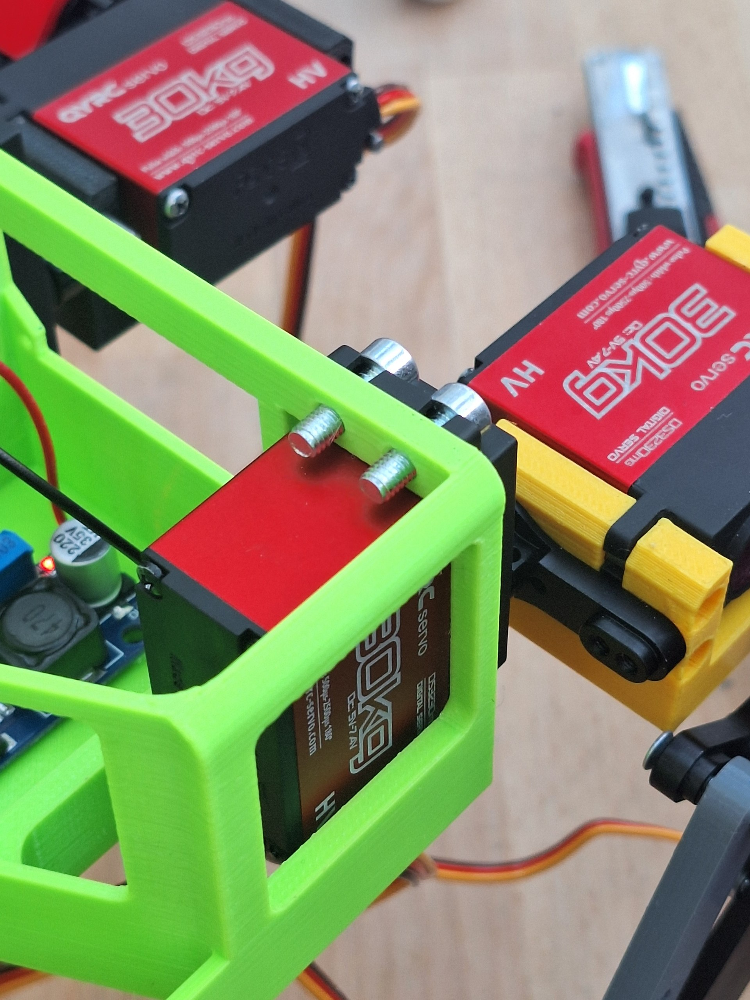
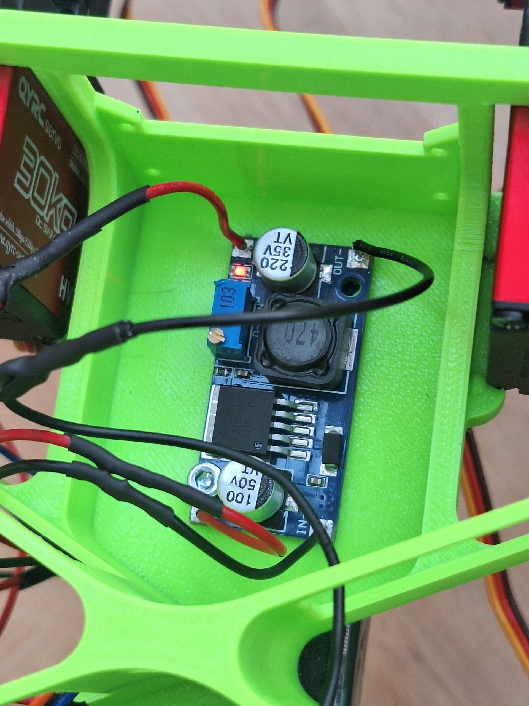
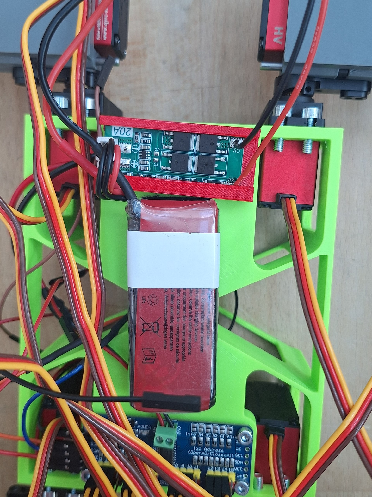
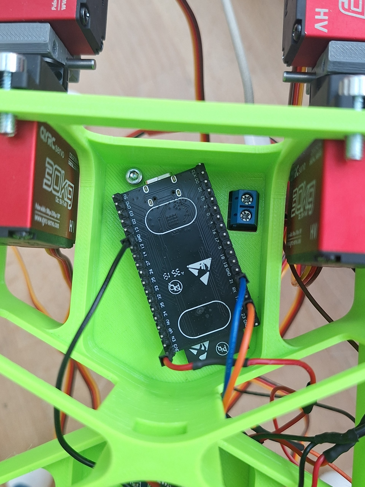

# 🧩 Assembly Instructions

Follow these steps to assemble Pluto. Read [Wiring & Electrical](WIRING_ELECTRICAL.md) before powering anything.

## 🎯 Build Philosophy

This guide assumes a future team is building Pluto from scratch. Build and test one layer at a time:

1. Print and inspect the mechanical parts.
2. Assemble one leg and verify that all joints move freely by hand.
3. Assemble the remaining legs only after the first leg is understood.
4. Mount electronics without connecting the battery yet.
5. Build and verify the power system with a multimeter.
6. Flash firmware over USB before using battery power.
7. Test individual joints before testing full gaits.

Do not skip directly to walking. Most failures in quadruped builds come from reversed servo orientation, incorrect power wiring, missing common ground, or uncalibrated joint limits.

## 📋 Required Inputs Before Starting

| Item | Source |
| --- | --- |
| Printed body and leg meshes | [CAD_FILES.md](CAD_FILES.md), `src/3D printing mesh/` |
| Wiring plan | [WIRING_ELECTRICAL.md](WIRING_ELECTRICAL.md) |
| Firmware setup | [src/esp/README.md](src/esp/README.md) |
| Servo calibration file | `src/esp/legs/leg_data.h` |
| Troubleshooting checklist | [TROUBLESHOOTING.md](TROUBLESHOOTING.md) |

## 🧭 Mechanical Orientation

The code uses four leg positions:

| Firmware name | Physical meaning |
| --- | --- |
| `TOP_LEFT` | Forward-facing left leg |
| `TOP_RIGHT` | Forward-facing right leg |
| `BOTTOM_LEFT` | Rear-facing left leg |
| `BOTTOM_RIGHT` | Rear-facing right leg |

The mesh filenames use the same idea:

- `tl_*`: top-left leg parts.
- `tr_*`: top-right leg parts.
- `bl_*`: bottom-left leg parts.
- `br_*`: bottom-right leg parts.

Keep this orientation consistent while assembling, wiring, and calibrating. If a leg is physically swapped, the servo channel mapping and calibration values will no longer match the robot.

## 🖨️ 1. Print Parts

Print the required body and leg parts from the current physical mesh set in [src/3D printing mesh](<src/3D printing mesh>). The active mesh inventory is documented in [CAD_FILES.md](CAD_FILES.md).

Current physical print groups:

- Top-level body/electronics/foot parts: `Main Body.stl`, `Board Holder.stl`, `Sensor Holder.stl`, `TPU Foot.stl`
- Front-left leg folder: coxa, inner/outer femur, femur spacer, tibia, inner mirror tibia, and linkage bar
- Front-right leg folder: coxa, inner/outer femur, femur spacer, inner tibia, inner mirror tibia, and linkage bar
- Back-left leg folder: coxa, inner/outer femur, femur spacer, inner tibia, inner mirror tibia, and linkage bar
- Back-right leg folder: coxa, inner/outer femur, femur spacer, inner tibia, inner mirror tibia, and linkage bar

The MuJoCo-style names such as `body.stl`, `tl_coxa.stl`, and `br_tibia.stl` are simulation meshes under `src/sim/sim_mesh/`, not the main physical printing inventory.

Print rigid body and leg parts in PLA or PETG. Print `TPU Foot.stl` in TPU or another flexible material.

## ⚡ 2. Prepare Electronics

Before installing electronics in the body:

1. Adjust the LM2596 buck converter output with a multimeter.
2. Confirm LiPo polarity and XT60 wiring.
3. Confirm the PCA9685 logic and servo power paths.
4. Confirm all grounds will be connected together.
5. Check the ultrasonic ECHO voltage level before connecting it to an ESP32 GPIO.

Full wiring guide: [WIRING_ELECTRICAL.md](WIRING_ELECTRICAL.md)

## 🧩 3. Assemble Legs

Each leg has three main sections:

- Coxa: hip joint.
- Femur: upper leg.
- Tibia: lower leg.

Each leg requires:

- 3 servos.
- 3 servo horns or servo arms.
- M3 screws for most mechanical connections.
- Bearings and linkage hardware for the tibia mechanism.
- Printed `TPU Foot.stl` part or a rubber pad substitute.

### 🧩 Step 1: Assemble the Tibia

- Take the two tibia printed parts.
- Insert a ball bearing between both parts.
- Align the pieces and screw them together.
- Glue or fasten the printed TPU foot to the lower end.

  
  
  

### 🧩 Step 2: Assemble the Femur

- Take the femur inner part, spacer, and outer part.
- Place the servo between the femur sides.
- Stack the three parts around the servo.
- Add adjacent screws to reinforce the structure and improve stability.

  
  

### 🧩 Step 3: Assemble the Coxa

- Take the coxa printed part for the selected leg.
- Insert the screw from the correct side for that leg's geometry.
- Attach the coxa to the servo horn mounted on the body.
- Mount the coxa servo and check that the open sections are aligned.

### 📌 Step 4: Attach the Femur to the Coxa

- Take the assembled femur.
- Align the highest hole on the femur outer part with the coxa servo horn.
- Secure the connection using an M3x35 screw.

  

### 📌 Step 5: Attach the Tibia to the Femur

- Attach the printed linkage bar to the femur servo horn using the side with the single hole.
- Connect the opposite side of the linkage bar to the upper tibia part.
- Choose the linkage hole position based on the desired bend:
  - Holes closer to the center create a smaller bending angle.
- Holes farther away create a larger bending angle.

  

### 📌 Step 6: Repeat for All Legs

Repeat the previous steps for each leg. Check:

- Servo orientation.
- Screw tightness.
- Smooth joint movement.
- Correct linkage alignment.
- No mechanical blocking across the expected range.

  
  

## 🧩 4. Assemble the Body

Use M3 screws unless a part requires a different size. Coxa servos use M2.5 screws.

1. Screw the coxa servo motors onto the body.
2. Mount the PCA9685 servo driver.
3. Mount the buck converter.
4. Slide the ultrasonic sensor into its holder and secure it.
5. Slide the protection board into its holder and secure it.
6. Attach the LiPo with Velcro or another removable mount.
7. Mount the microphone if used.
8. Slide or mount the ESP32 into the body.

Reference images:

  
  
  
  

## 📌 5. Wire and Test

1. Plug all cables according to [WIRING_ELECTRICAL.md](WIRING_ELECTRICAL.md).
2. Check polarity and continuity with a multimeter.
3. Flash the ESP32 firmware.
4. Open the serial monitor at `115200`.
5. Test stand, stop, and small trimming commands before walking.
6. Tune servo calibration in `src/esp/legs/leg_data.h`.

## 🧩 Bring-Up Sequence After Assembly

Use this order after the robot is mechanically assembled:

1. Power the ESP32 from USB only.
2. Build and upload the firmware with `pio run -t upload`.
3. Open the serial monitor with `pio device monitor -b 115200`.
4. Confirm that the firmware prints the command list.
5. Power the PCA9685 logic side and confirm it initializes.
6. Connect only one servo or one leg for first motion tests if possible.
7. Use `l` and `n` to select leg and joint, then `+`, `-`, `r`, and `p` for small trimming checks.
8. Confirm that increasing/decreasing pulse values moves the expected joint.
9. Update `src/esp/legs/leg_data.h` if a joint direction, start pulse, or safe range is wrong.
10. Repeat for all joints before running walking commands.

## ✅ Completion Checklist

The hardware build is not complete until all checks pass:

- All screws are tight but joints still move freely.
- No wire can be caught by a moving leg.
- Battery is mounted securely and can be disconnected quickly.
- Buck converter output has been measured.
- ESP32, PCA9685, sensors, and servo power share ground.
- Each servo channel moves the expected joint.
- Servo calibration limits prevent mechanical over-travel.
- `s` returns the robot to stop/stand behavior.

Software instructions: [SOFTWARE_OVERVIEW.md](SOFTWARE_OVERVIEW.md)

Troubleshooting: [TROUBLESHOOTING.md](TROUBLESHOOTING.md)
