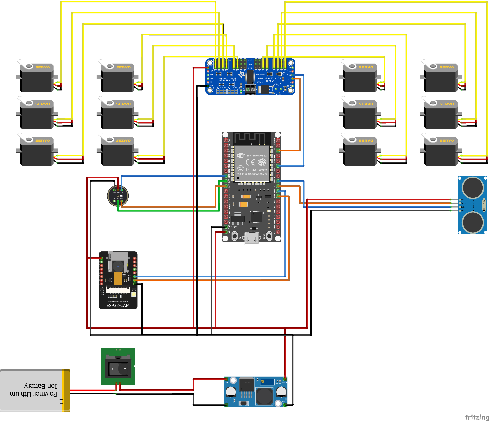

# Pluto

> A four-legged canine robot with ESP32-based gait control, calibrated 12-servo actuation, WiFi command transport, voice-triggered behaviors, obstacle/audio reactions, and simulation support through Python and MuJoCo assets.



Live Demo

Demo media can be added here once final robot videos are available.

## Project Context

### Abstract

Pluto is a compact 12-degree-of-freedom quadruped robot. Each of its four legs has three actuated joints: coxa, femur, and tibia. The project combines mechanical design, embedded motor control, inverse kinematics, gait generation, wireless communication, sensor feedback, speech interaction, and simulation.

The current repository contains the main implementation layers for that platform:

1. Robot-side ESP32 firmware for servo control, gait execution, ultrasonic sensing, microphone sensing, and optional WiFi/UDP command handling.
2. Computer-side Python tooling for a NiceGUI control hub, keyboard/gamepad input, speech command handling, telemetry display, and simulation control.
3. Shared communication definitions that keep the Python controller and C++ firmware aligned.
4. Updated CAD and simulation assets, including per-leg STL meshes and a MuJoCo model.

The robot is designed as an extensible quadruped platform rather than a one-off demo. The same concepts of leg geometry, foot targets, joint calibration, gait phase offsets, and command messages appear across the firmware, controller, and simulation code.

### Course Context

This project was developed as part of the Making Intelligent Things course at EPFL.

### Acknowledgments

- Course staff, TAs, and coaches for guidance throughout the design and development process.
- Open-source quadruped projects, including SpotMicro-style robots and related tutorials, for inspiration on mechanical structure and legged locomotion.
- Documentation and examples from Arduino, PlatformIO, Adafruit, NiceGUI, PyBullet, MuJoCo, Vosk, and sounddevice.

### Note on Continued Development

Pluto remains a work in progress. The current codebase includes the main building blocks for motion, sensing, simulation, and communication, but the physical robot still needs final calibration, gait validation, and behavior tuning. For current limitations and future directions, see [Ongoing Works & Next Steps](ONGOING_WORK.md).

---

## Quick Jump To Detailed Documentation

For in-depth technical details, refer to the dedicated subsystem documentation:

### [Hardware: Step by Step How to Build](ASSEMBLY.md)

Assembly instructions, wiring diagrams, CAD files, component specs, and final hardware checks.

### [ESP32 Firmware: Motion, Sensors, and Robot Control](src/esp/README.md)

Servo output, leg abstractions, inverse kinematics, gait generation, sensor hooks, serial commands, and optional WiFi/UDP handling.

### [Python Controller: UI, Speech, Input, and Simulation](src/control/README.md)

NiceGUI pages, keyboard/gamepad input, controller messages, speech worker, and simulation controls.

### [Shared Communication Protocol](src/comm/README.md)

Binary packet/message definitions shared by C++ firmware and Python control code.

### [Software Overview](SOFTWARE_OVERVIEW.md)

High-level map of the implemented firmware, controller, communication, simulation, and sensor layers.

### [Troubleshooting Guide](TROUBLESHOOTING.md)

First-time setup issues, build problems, power checks, WiFi debugging, sensor checks, and firmware notes.

---

## Table of Contents

1. [Project Overview](#project-overview)
2. [Quick Start](#quick-start)
3. [Hardware](#hardware)
4. [System Architecture](#system-architecture)
5. [Software Setup](#software-setup)
6. [Configuration & Tuning](#configuration--tuning)
7. [Documentation Index](#documentation-index)
8. [Archives](#archives)
9. [Ongoing Works & Next Steps](#ongoing-works--next-steps)
10. [Credits](#credits)
11. [Conclusion](#conclusion)

---

## Project Overview

### Vision

Pluto is a quadruped robotics platform for learning and testing legged locomotion across both hardware and simulation. The goal is to make a small canine-style robot that can stand, walk, trot, gallop, react to simple sensor events, and accept commands through serial, WiFi, UI controls, and speech.

The robot-side firmware handles time-sensitive work close to the hardware: 12-servo actuation through a PCA9685, inverse kinematics, gait updates, ultrasonic distance checks, microphone energy checks, and optional UDP message processing. The computer-side software handles interface-heavy work: NiceGUI pages, keyboard/gamepad input, speech recognition, telemetry display, and simulation.

### How Pluto "Thinks"

Pluto operates through three cooperating layers:

High-Level Control (Python Control Hub):

1. Select mode - The NiceGUI home page opens either simulation mode or controller mode.
2. Collect input - WASD and browser gamepad input are converted into a normalized movement vector.
3. Recognize speech - Vosk listens for supported phrases and maps them to command messages.
4. Package commands - Python creates movement, behavior, and control messages using the shared protocol.
5. Maintain connection - The controller can connect to the robot, send control-begin messages, send movement updates, and display telemetry.

Robot Execution (ESP32 Firmware):

1. Initialize - Start serial, PCA9685, gait state, ultrasonic sensor, microphone, and optional WiFi.
2. Sense - Read ultrasonic distance and microphone energy.
3. React - Stop forward motion near a wall and toggle walking on loud clap events.
4. Generate gait - Produce walk, trot, gallop, bow, paw, stop, and stand motion commands.
5. Solve IK - Convert desired foot targets into coxa, femur, and tibia angles.
6. Actuate - Map calibrated joint angles to constrained PCA9685 PWM pulses.

Simulation and Assets:

1. Load model - Use the updated `src/mesh` STL files and `pluto.xml` model.
2. Reuse logic - The MuJoCo simulation bridge reuses the ESP gait controller through a mock PWM driver.
3. Test safely - Gait timing and actuator mapping can be inspected before running risky movements on the physical robot.

### Technical Vocabulary

- ESP32: Microcontroller running the robot firmware.
- PCA9685: I2C PWM driver used to control the 12 servo channels.
- 12-DOF: Twelve degrees of freedom, with three actuated joints per leg.
- Coxa, femur, tibia: The hip-yaw, upper-leg, and lower-leg joints.
- IK: Inverse kinematics, converting foot targets into joint angles.
- Gait: Timed leg movement pattern such as walk, trot, or gallop.
- UDP: Lightweight network protocol used for controller-to-robot messages.
- CRC: Packet integrity check used by the shared communication protocol.
- NiceGUI: Python web UI framework used for the control hub.
- Vosk: Offline speech recognition engine.
- MuJoCo: Physics simulator used by `src/mesh/pluto.xml` and `src/sim/sim.cpp`.
- PyBullet: Python simulation dependency used by the control stack.

### Key Objectives

- Reliable servo control: Drive 12 calibrated joints safely through the PCA9685.
- Legged locomotion: Support stand, stop, walk, trot, gallop, bow, and paw motion primitives.
- IK-based movement: Generate joint angles from foot targets instead of fixed pulse sequences.
- Remote operation: Use a shared UDP protocol for movement, behavior, info, acknowledgement, and sensor messages.
- Sensor reactions: Stop near obstacles and use microphone energy for clap-triggered start/stop behavior.
- Simulation before hardware: Keep mesh and simulation assets available for gait development.
- Clear documentation: Keep hardware, wiring, firmware, controller, protocol, and troubleshooting notes separated.

### Core Technologies

- Hardware: ESP32, PCA9685, 12 DMS15-style servos, HC-SR04-style ultrasonic sensor, INMP441 I2S microphone, 2S LiPo, LM2596 buck converter.
- Firmware: C++17, Arduino framework, FreeRTOS, PlatformIO, Adafruit PWM Servo Driver, Adafruit BusIO.
- Control UI: Python 3.13, NiceGUI, keyboard/gamepad input, Vosk, sounddevice.
- Simulation: PyBullet, MuJoCo, GLFW, STL mesh assets.
- Communication: Custom C++/Python UDP packet format with session token, sequence number, timestamp, CRC, and packed messages.

### System at a Glance

```text
    +---------------------------------------------------------+
    |  Python Control Hub (computer)                          |
    |  - NiceGUI home, simulation, and controller pages        |
    |  - Keyboard/gamepad movement vectors                    |
    |  - Vosk speech worker                                   |
    |  - UDP packet packing, connection, telemetry display     |
    +----------------------------+----------------------------+
                                 |
                                 | WiFi / UDP port 4242
                                 v
    +---------------------------------------------------------+
    |  ESP32 Robot Controller                                 |
    |  - 20 ms gait update loop                               |
    |  - PCA9685 12-servo output                              |
    |  - IK solver and gait controller                        |
    |  - Ultrasonic wall stop and microphone clap toggle       |
    |  - Optional FreeRTOS UDP server                          |
    +----------------------------+----------------------------+
                                 |
                                 v
    +---------------------------------------------------------+
    |  Hardware and Simulation Assets                         |
    |  - Four 3-DOF legs: coxa, femur, tibia                  |
    |  - Per-leg STL meshes and MuJoCo XML model              |
    |  - Power, wiring, sensors, and calibration data          |
    +---------------------------------------------------------+
```

---

## Quick Start

### Prerequisites Checklist

Hardware:

- Assembled Pluto robot, or a safe bench setup with the ESP32, PCA9685, and servos.
- Charged 7.4V 2S LiPo battery.
- USB cable for flashing and monitoring the ESP32.
- Common-ground wiring between the ESP32, PCA9685, servo power rail, sensors, and battery system.
- Computer on the same network as the ESP32 if WiFi control is enabled.

Software:

- Python 3.13.
- PlatformIO Core or the PlatformIO VS Code extension.
- A desktop environment that can open the NiceGUI web interface and simulation windows.

### Flash & Run

Step 0: Clone the Repository

```bash
git clone https://github.com/epfl-cs358/2026sp-pluto.git
cd 2026sp-pluto
```

Step 1: Install and Launch the Control Hub

macOS/Linux:

```bash
bash run.sh
```

Windows:

```cmd
run.bat
```

The run scripts create or reuse `.venv`, install `requirements.txt`, and launch the NiceGUI app. The default script port is `8090`.

```text
http://localhost:8090
```

To force a clean Python dependency reinstall:

```bash
bash run.sh --reinstall
```

To use another port:

```bash
bash run.sh --port 8081
```

Step 2: Flash ESP32 Firmware

```bash
pio run
pio run -t upload
```

If PlatformIO does not detect the port automatically:

```bash
pio device list
pio run -t upload --upload-port /dev/cu.usbserial-XXXX
```

Step 3: Monitor and Test

```bash
pio device monitor -b 115200
```

Expected startup behavior:

- The PCA9685 initializes at 50 Hz.
- Ultrasonic and microphone sensors initialize when enabled.
- The robot enters the stand pose.
- The serial monitor prints the available motion and trimming commands.

First-time issues? Check [TROUBLESHOOTING.md](TROUBLESHOOTING.md).

> Dev Note: WiFi/UDP support exists but is currently disabled by default in `src/esp/main.cpp`. Enable `PLUTO_ENABLE_WIFI`, configure access points, and set `IP_OF_ESP` in `src/control/main.py` before testing live WiFi control.

---

## Hardware

### Component List

| Component | Qty | Role |
| --- | ---: | --- |
| 3D-printed body and leg parts | 1 set | Robot structure and leg links |
| DMS15-style 270-degree servos | 12 | Three actuated joints per leg |
| PCA9685 16-channel PWM driver | 1 | Servo PWM generation over I2C |
| ESP32 development board | 1 | Main embedded controller |
| HC-SR04-style ultrasonic sensor | 1 | Front obstacle distance sensing |
| INMP441 I2S microphone | 1 | Audio input and clap-energy detection |
| 7.4V 2S LiPo battery with XT60 | 1 | Main power source |
| LM2596 buck converter | 1 | Voltage regulation for low-voltage electronics |
| KCD1 rocker switch | 1 | Main power switching |
| Servo horns, screws, bearings, wires, heat-shrink | As needed | Mechanical and electrical assembly |
| TPU feet or rubber pads | 4 | Traction and impact reduction |

Additional materials needed:

- PLA/PETG filament for rigid printed parts.
- TPU filament or rubber pads for feet.
- M3 and M2.5 screws for the body, legs, and servo mounting.
- Ball bearings for tibia joints.
- Jumper wires for logic signals and thicker wires for servo current.
- Soldering equipment, heat-shrink tubing, electrical tape, and cable ties.
- Multimeter for voltage, polarity, and continuity checks.
- LiPo-safe charger and LiPo-safe storage bag.

### Assembly Overview

Clicky link: [Full step-by-step assembly guide here](ASSEMBLY.md)

Pluto is built around a central 3D-printed body and four modular legs. Each leg contains a coxa, femur, and tibia segment driven by three servos. The electronics are mounted in or on the body, with the PCA9685 driving servo channels and the ESP32 handling firmware, sensors, and optional WiFi communication.

Assembly phases:

1. 3D-printed parts - Print the body, coxa, femur, tibia, and any sensor/battery mounts.
2. Leg assembly - Build each coxa/femur/tibia chain with servos, horns, screws, bearings, and feet.
3. Body assembly - Mount coxa servos, PCA9685, buck converter, ESP32, ultrasonic sensor, microphone, and LiPo.
4. Wiring - Connect power rails, common ground, I2C, servo outputs, and sensor pins.
5. Final checks - Verify polarity, buck output, cable routing, firmware upload, and basic serial commands.

Full step-by-step assembly guide:
-> [Complete Assembly Instructions](ASSEMBLY.md)

### Wiring & Electrical

Clicky link: [Full wiring explanation here](WIRING_ELECTRICAL.md)

Electrical Diagram:


Important Wiring Notes:

- Common ground: The LiPo/servo ground, PCA9685 ground, ESP32 ground, buck converter ground, and sensor grounds must be connected together.
- Servo power vs logic power: Servos draw much higher current than the ESP32 and sensors. Plan the power paths separately.
- Buck converter check: Adjust and measure the LM2596 output before connecting the ESP32 or sensors.
- PCA9685 wiring: Connect SDA/SCL between the ESP32 and PCA9685 and provide both logic power and servo power.
- Ultrasonic sensor: If the ECHO pin outputs 5V, use a voltage divider or level shifter before the ESP32 GPIO.
- High-current wiring: Use appropriate wire thickness for LiPo, XT60, rocker switch, servo power rail, and PCA9685 servo power input.

Detailed wiring and soldering guide:
-> [Wiring & Electrical](WIRING_ELECTRICAL.md)

### CAD Files

You can explore all current STL files directly in [src/mesh](src/mesh).

Current mesh set:

- `body.stl`
- `tl_coxa.stl`, `tl_femur.stl`, `tl_tibia.stl`
- `tr_coxa.stl`, `tr_femur.stl`, `tr_tibia.stl`
- `bl_coxa.stl`, `bl_femur.stl`, `bl_tibia.stl`
- `br_coxa.stl`, `br_femur.stl`, `br_tibia.stl`
- `pluto.xml`

The old generic `coxa`, `femur`, and `tibia` meshes have been replaced by per-leg meshes. The naming convention is `tl`, `tr`, `bl`, and `br` for top-left, top-right, bottom-left, and bottom-right.

Before implementing hardware changes, check [Ongoing Works & Next Steps](ONGOING_WORK.md) for known hardware limitations and recommended improvements.

---

## System Architecture

The computational load is divided between the ESP32 robot controller and the Python control hub:

- ESP32 Robot Controller: Low-level motion control, servo actuation, sensor reads, serial commands, and optional UDP packet handling.
- Python Control Hub: User interface, keyboard/gamepad input, speech commands, simulation controls, and UDP command generation.
- Shared Communication Layer: Compact packet and message definitions mirrored in C++ and Python.
- Simulation Assets: Per-leg STL meshes, MuJoCo XML model, and simulation bridge code.

Rationale:

1. Real-time control: Servo updates and gait generation stay on the ESP32 close to the hardware.
2. Modularity: Motion, communication, sensing, input, and simulation are split into focused modules.
3. Safety: The firmware can stop or stand the robot even if the desktop controller is disconnected.
4. Reuse: The shared protocol keeps Python and C++ behavior aligned.
5. Testability: Simulation assets allow gait experiments before hardware tests.

Note: The ESP32, Python controller, and communication layers each have dedicated README files:

- [src/esp/README.md](src/esp/README.md)
- [src/control/README.md](src/control/README.md)
- [src/comm/README.md](src/comm/README.md)

### Architecture Diagram

```text
    +----------------------------------------------------------+
    | Python Control Hub                                      |
    | src/control/main.py                                     |
    |                                                          |
    | - NiceGUI home, simulation, and controller pages          |
    | - Keyboard/gamepad movement input                        |
    | - Vosk speech commands                                   |
    | - UDP session, heartbeat, packet packing/unpacking        |
    +-----------------------------+----------------------------+
                                  |
                                  | WiFi / UDP port 4242
                                  v
    +----------------------------------------------------------+
    | ESP32 Robot Controller                                   |
    | src/esp/main.cpp                                         |
    |                                                          |
    | - 20 ms gait/motion update loop                          |
    | - PCA9685 12-servo output                                |
    | - Inverse kinematics and gait generation                  |
    | - Ultrasonic and microphone reactions                     |
    | - Optional FreeRTOS UDP server                            |
    +-----------------------------+----------------------------+
                                  |
                                  v
    +----------------------------------------------------------+
    | Hardware and Simulation                                  |
    |                                                          |
    | - Four 3-DOF legs: coxa, femur, tibia                    |
    | - DMS15 servos, PCA9685, ESP32, LiPo power                |
    | - STL meshes, MuJoCo XML model, simulation bridge         |
    +----------------------------------------------------------+
```

### ESP32 Robot Controller

[Full ESP32 Documentation ->](src/esp/README.md)

Primary mission: execute reliable low-level robot control on the physical quadruped.

Core Responsibilities:

- Initialize the PCA9685 servo driver.
- Drive all 12 joints through calibrated `LegJoint` objects.
- Convert IK outputs into constrained PWM pulses.
- Update gait motion every 20 ms.
- Handle serial commands for gait selection, speed changes, manual walk staging, and servo trimming.
- Read ultrasonic distance and stop when a wall is too close.
- Read microphone energy and toggle walking on clap detection.
- Optionally accept UDP commands through the Pluto server.

Key Components:

- `src/esp/main.cpp`: firmware entry point and top-level control loop.
- `src/esp/legs/leg_data.h`: per-joint raw PWM and angle calibration.
- `src/esp/legs/leg_joint.h`: calibrated servo output abstraction.
- `src/esp/legs/leg.h`: 3-joint leg abstraction.
- `src/esp/motion/ik_solver.cpp`: embedded inverse kinematics.
- `src/esp/motion/gait.cpp`: walk, trot, gallop, bow, paw, and stand generation.
- `src/esp/sensors/ultrasonic.h`: ultrasonic distance readings.
- `src/esp/sensors/microphone.h`: I2S microphone sampling and energy measurement.
- `src/esp/server/server.cpp`: UDP sessions, CRC validation, acknowledgements, and queues.

Operating frequency:

- Motion/gait update: 50 Hz, every 20 ms.
- Ultrasonic read cycle: every 150 ms.
- Microphone energy print cycle: every 150 ms.
- Serial monitor baud rate: 115200.

### Python Controller

[Full Controller Documentation ->](src/control/README.md)

Primary mission: provide the operator-facing interface, simulation mode, speech commands, and UDP command transport.

Core Responsibilities:

- Serve the NiceGUI app from `src/control/main.py`.
- Provide navigation between home, simulation, and controller pages.
- Read keyboard and gamepad input through `InputManager`.
- Send repeated `MOVE_BY` messages while movement input is non-zero.
- Send quick behavior commands for sit, give paw, and stop.
- Display telemetry for acknowledgements and distance readings.
- Start a Vosk speech worker on app startup.
- Start and stop simulation support from the UI.

Key Components:

- `src/control/main.py`: app entry point.
- `src/control/pluto_menu/controller.py`: keyboard/gamepad controller page.
- `src/control/pluto_menu/simulation.py`: simulation UI controls.
- `src/control/pluto_input/input_manager.py`: normalized movement vectors.
- `src/control/pluto_speech/speech.py`: Vosk speech worker.
- `src/control/pluto_server/message.py`: Python packet/message definitions.
- `src/control/pluto_server/server.py`: UDP controller client.
- `src/control/gait.py`: Python gait definitions.
- `src/control/sim_motion.py`: simulation process control.

### Communication Architecture

#### Controller-to-Robot Communication (WiFi/UDP)

Protocol: Custom packet-based binary protocol with CRC validation, session tokens, sequence numbers, timestamps, and packed fixed-size messages.

Data Flow:

| Direction | Message Type | Content |
| --- | --- | --- |
| Python -> ESP32 | `MOVE_BY` | Movement vector for directional control |
| Python -> ESP32 | `MOVE_STOP_FOR` | Stop/stand command |
| Python -> ESP32 | `BEHAVIOR_*` | Sit, give paw, lie down, and related behavior commands |
| Python -> ESP32 | `INFO_REQUEST_*` | Heartbeat and sensor requests |
| ESP32 -> Python | `INFO_ACKNOWLEDGE` | Packet acknowledgement |
| ESP32 -> Python | `SENSOR_DISTANCE` | Ultrasonic distance telemetry |

Full protocol documentation:
-> [Communication Protocol](src/comm/README.md)
-> [WiFi Protocol](SOFTWARE_WIFI.md)

### Shared Mechanisms

- `src/comm/message.h`: C++ packet and message definitions.
- `src/control/pluto_server/message.py`: Python mirror of the packet and message definitions.
- `src/esp/server/server.cpp`: robot-side UDP session handling.
- `src/control/pluto_server/server.py`: computer-side UDP client handling.
- `src/mesh/pluto.xml`: MuJoCo robot model using the current mesh assets.
- `src/sim/MockPWMServoDriver.h`: simulation adapter for reusing ESP gait code.

---

## Software Setup

### Development Environment

Prerequisites:

- Python 3.13.
- PlatformIO Core or VS Code PlatformIO extension.
- ESP32 board support through PlatformIO.
- Desktop audio support if using Vosk/sounddevice speech commands.
- MuJoCo/GLFW-compatible desktop environment if using the C++ simulation bridge.

### Project Structure

```text
2026sp-pluto/
|-- src/
|   |-- comm/            # Shared protocol definitions
|   |-- control/         # Python UI, input, speech, and controller client
|   |-- esp/             # ESP32 firmware
|   |-- mesh/            # STL meshes and MuJoCo XML model
|   `-- sim/             # C++ MuJoCo simulation bridge
|-- scripts/             # Python environment installation scripts
|-- images/              # Documentation photos and diagrams
|-- platformio.ini       # PlatformIO firmware configuration
|-- requirements.txt     # Python dependencies
|-- run.sh / run.bat     # Controller launch scripts
`-- *.md                 # System, hardware, software, and troubleshooting docs
```

### Python Dependencies

`requirements.txt` currently contains:

- `nicegui`
- `numpy`
- `debugpy`
- `pybullet`
- `mujoco`
- `glfw`
- `vosk`
- `sounddevice`

The recommended path is to use `run.sh` or `run.bat`, since these scripts manage `.venv` and skip reinstalling dependencies when `requirements.txt` is unchanged.

Manual setup, if needed:

```bash
python3.13 -m venv .venv
source .venv/bin/activate
pip install -r requirements.txt
python src/control/main.py --port 8090
```

### PlatformIO Firmware Environment

The active environment is:

```ini
[env:esp32dev]
platform = espressif32
board = esp32dev
framework = arduino
monitor_speed = 115200
build_unflags = -std=gnu++11
build_flags = -std=gnu++17
```

PlatformIO is configured with:

- `src_dir = src/esp`
- `include_dir = src/`
- `build_dir = .build/`
- `build_src_filter` excluding `src/esp/sim/**` from firmware builds.

Firmware dependencies:

- Adafruit PWM Servo Driver Library.
- Adafruit BusIO.

### Simulation

Pluto has two simulation-facing paths:

- Python-side simulation/control files under `src/control`.
- MuJoCo C++ bridge under `src/sim`, using `src/mesh/pluto.xml` and the current per-leg STL files.

The C++ bridge reuses the embedded gait controller with `MockPWMServoDriver`, then maps the 12 resulting joint angles to MuJoCo actuators.

---

## Configuration & Tuning

### Firmware Feature Flags

Current flags in `src/esp/main.cpp`:

```cpp
// #define PLUTO_ENABLE_WIFI
#define PLUTO_ENABLE_ULTRASONIC
#define PLUTO_ENABLE_MICROPHONE
```

Current default:

- Ultrasonic support is enabled.
- Microphone support is enabled.
- WiFi/UDP support is present but disabled by default.

To test WiFi control:

1. Enable `PLUTO_ENABLE_WIFI`.
2. Configure access points with `PLUTO_SERVER.addAP(...)` in `setup()`.
3. Set the ESP32 IP address in `src/control/main.py`.
4. Verify that Python and C++ message definitions remain aligned.

### Servo Calibration

Servo calibration lives in:

```text
src/esp/legs/leg_data.h
```

Each joint has:

- `raw_min`
- `raw_max`
- `raw_start`
- `angle_min_md`
- `angle_max_md`
- `inverted`

These values define how an IK angle maps to a safe PWM pulse. Tune them on the real robot before running aggressive gaits.

### Serial Command Tuning

Use `pio device monitor -b 115200`.

| Key | Action |
| --- | --- |
| `f` | Move forward |
| `b` | Move backward |
| `o` | Bow |
| `k` | Give paw |
| `s` | Stop and stand |
| `1` | Select walk gait |
| `2` | Select trot gait |
| `3` | Select gallop gait |
| `0` | Set speed to 0% |
| `5` | Set speed to 50% |
| `9` | Set speed to 100% |
| `u` | Toggle manual walk phase mode |
| `m` | Advance manual walk stage |
| `j` | Advance manual walk leg |
| `l` | Select next leg for trimming |
| `n` | Select next joint for trimming |
| `+` | Increase selected joint raw PWM by 5 |
| `-` | Decrease selected joint raw PWM by 5 |
| `r` | Reset selected joint to starting pulse |
| `R` | Reset all joints on selected leg |
| `p` | Print selected leg, joint, and pulse |

### Gait Parameters

Embedded gait code lives in:

```text
src/esp/motion/gait.cpp
src/esp/motion/gait.h
```

Embedded IK code lives in:

```text
src/esp/motion/ik_solver.cpp
src/esp/motion/ik_solver.h
```

Tune these areas carefully:

- Stand pose.
- Foot target geometry.
- Stride length.
- Lift height.
- Gait period.
- Walk/trot/gallop phase offsets.
- Per-leg symmetry.
- Bow and paw target poses.

### Sensor Pins and Thresholds

Current firmware templates:

- Ultrasonic: `SensorUltraSonic<5, 18>`
- Microphone: `SensorMicrophone<26, 25, 33>`

Current behavior constants:

- Wall stop distance: 20 cm.
- Ultrasonic period: 150 ms.
- Microphone clap threshold: 2000000.
- Clap cooldown: 800 ms.

Verify pins and thresholds against the actual wiring before physical gait tests.

---

## Documentation Index

### Main System

- [Main README](README.md) - This document.
- [Software Overview](SOFTWARE_OVERVIEW.md) - High-level software map.
- [Ongoing Works & Next Steps](ONGOING_WORK.md) - Current limitations and future work.
- [Troubleshooting](TROUBLESHOOTING.md) - Setup and debugging guide.

### Hardware Documentation

- [Hardware Overview](HARDWARE_OVERVIEW.md)
- [Assembly Guide](ASSEMBLY.md)
- [Wiring & Electrical](WIRING_ELECTRICAL.md)
- [CAD Files](CAD_FILES.md)

### Software Documentation

- [ESP32 Firmware](src/esp/README.md)
- [Python Controller](src/control/README.md)
- [Communication Protocol](src/comm/README.md)
- [WiFi Protocol](SOFTWARE_WIFI.md)
- [Software Sensors](SOFTWARE_SENSORS.md)

### Key Source Files

- [Python UI entry point](src/control/main.py)
- [Controller page](src/control/pluto_menu/controller.py)
- [Simulation page](src/control/pluto_menu/simulation.py)
- [Python message definitions](src/control/pluto_server/message.py)
- [ESP firmware entry point](src/esp/main.cpp)
- [ESP gait controller](src/esp/motion/gait.cpp)
- [ESP IK solver](src/esp/motion/ik_solver.cpp)
- [Shared C++ message definitions](src/comm/message.h)
- [MuJoCo model](src/mesh/pluto.xml)
- [C++ simulation bridge](src/sim/sim.cpp)

---

## Archives

The purpose of an archive area is to preserve earlier prototypes and tests without making them part of the active implementation.

This repository currently keeps most history through Git, current source files, and the notes in [ONGOING_WORK.md](ONGOING_WORK.md). If older experiments are added back for reference, they should be placed under an `archives/` directory with a short README explaining what was tested, why it was replaced, and whether it still runs.

Recommended archive categories:

- ESP32 experiments: old gait tests, servo calibration sketches, sensor bring-up code, and behavior prototypes.
- Control UI experiments: early NiceGUI pages, keyboard/gamepad tests, and speech command prototypes.
- Simulation experiments: PyBullet and MuJoCo model tests, gait playback experiments, and old mesh-loading attempts.
- Communication experiments: older UDP packet formats, handshake tests, and protocol debugging scripts.

See [ARCHIVES.md](ARCHIVES.md) for archive notes.

---

## Ongoing Works & Next Steps

Pluto continues to evolve beyond the initial course timeline. The current repository provides the main building blocks for locomotion, sensing, communication, and simulation, but several areas still need physical validation.

Current focus:

- Hardware gait validation: test walk, trot, gallop, bow, paw, and stop on the physical robot.
- Servo calibration: refine PWM limits, starting pulses, inversion flags, and angle ranges.
- WiFi control: enable and validate live UDP movement and behavior commands.
- Behavior implementation: replace placeholder behavior handlers with calibrated motion sequences.
- Sensor-driven reactions: tune ultrasonic wall stopping and microphone clap detection.
- Simulation fidelity: improve physical accuracy for mass, friction, joint limits, and servo response.

Known issues to address:

- WiFi support is present but disabled by default in `src/esp/main.cpp`.
- Some firmware behavior handlers are still placeholders.
- The ESP32 IP address is still a placeholder in `src/control/main.py`.
- Gait constants need final physical measurement and tuning.
- MuJoCo and PyBullet support are useful for development, but not yet perfect models of the real robot.
- Camera, IMU stabilization, SLAM, and higher-level autonomy remain future work.

See [Ongoing Works & Next Steps](ONGOING_WORK.md) for the full list.

---

## Credits

### Project Team

Pluto was developed by Serhat Botan, Alexis Cazal, Neha Chakraborty, Myriam Lahoud, Sam Lee, Raphael Dib Nehme, and Mariya Rakytyanska as part of EPFL's Making Intelligent Things course.

### Use of AI Tools in Development

This project documentation and parts of the development workflow were supported by AI-powered tools in accordance with EPFL academic integrity guidelines.

AI assistance was used for:

- Structuring documentation and improving technical writing.
- Debugging guidance and code review suggestions.
- Identifying edge cases in setup, communication, and hardware integration notes.
- Summarizing implementation details from the codebase.

AI assistance was not used to replace:

- Project goals or engineering decision-making.
- Hardware assembly, wiring, or physical testing.
- Experimental validation on the real robot.
- Team ownership of the system design and implementation.

All AI-assisted content should be reviewed and validated by the project team before submission or hardware use.

### Technical Inspiration

- SpotMicro and other open-source quadruped robot projects.
- Quadruped robotics tutorials and demonstrations used as design references.
- PyBullet and MuJoCo robot simulation examples.
- Arduino, PlatformIO, FreeRTOS, and Adafruit examples for embedded development.

### Technologies and Libraries

- Arduino and PlatformIO for embedded development.
- FreeRTOS for task scheduling on the ESP32.
- Adafruit PCA9685 library for servo output.
- NiceGUI for the Python control interface.
- PyBullet, MuJoCo, and GLFW for simulation.
- Vosk and sounddevice for speech input.

---

## Conclusion

Pluto demonstrates a practical path from a 3D-printed quadruped concept to a working robotics software platform. The project includes calibrated low-level actuation, inverse kinematics, gait generation, simulation assets, wireless command transport, and early sensing/interaction hooks.

The current system is not the final version of the robot. It is a foundation for continued tuning and experimentation, especially around gait stability, behavior execution, sensor-driven reactions, simulation fidelity, and higher-level autonomy.

### Questions, Issues, Or Feedback

For setup issues, check [TROUBLESHOOTING.md](TROUBLESHOOTING.md) first. For implementation details, use the [Documentation Index](#documentation-index) to find the relevant subsystem documentation.
